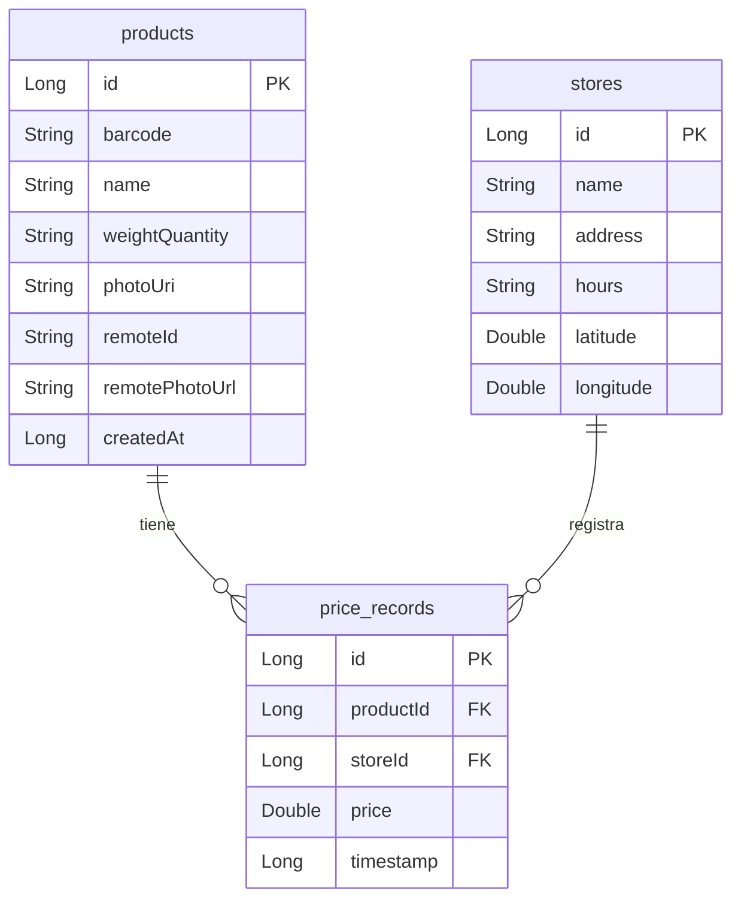

# 🛒 Compara Precios — Locales

<p align="center">
  
</p>

<p align="center">
  
  
  
  
  
  
  
  
</p>

---

## 📋 Descripción General

**Compara Precios** es una aplicación Android para **registrar y comparar precios de productos en locales comerciales** de tu zona. Podés agregar supermercados, almacenes o cualquier local, asociarles productos con sus precios y ver de un vistazo dónde conviene comprar cada artículo.

### ✨ Características principales

| Característica | Detalle |
|---|---|
| 📦 Gestión de locales | Nombre, dirección, horarios y coordenadas GPS |
| 🏷️ Gestión de productos | Código de barras, foto, peso/cantidad, precio por local |
| 📷 Escaneo de códigos de barras | Cámara en tiempo real vía CameraX + ML Kit |
| 🤖 Búsqueda cloud automática | Si el código de barras no está en el dispositivo, se busca en Firestore |
| 🌿 Segmentación de imagen | ML Kit recorta automáticamente el producto de la foto |
| 📊 Comparación de precios | Vista comparativa de todos los locales para un producto |
| 📈 Historial de precios | Gráfico de evolución de precios con filtros por período |
| 🔍 Búsqueda global | Encuentra productos y locales al mismo tiempo |
| ☁️ Sincronización manual | Comparte el catálogo con otros usuarios vía Firestore + Cloudinary |
| 📤 Exportar a CSV | Exporta todos los registros de precios para análisis externo |
| 🎨 Tema personalizable | Claro, Oscuro o según el sistema |
| 🔒 Privacidad garantizada | Los precios y locales **nunca** se suben a la nube; solo el catálogo de productos es compartido |

---

## 🏗️ Arquitectura

La app sigue el patrón **MVVM + Repository** con una estrategia **Local-First**: la base de datos local (Room) es siempre la fuente de verdad. La nube se consulta únicamente cuando un dato no existe localmente.

```
┌─────────────────────────────────────────────────────────────┐
│                          UI Layer                           │
│  Screens (Compose)  ◄──►  ViewModels  ◄──►  StateFlows     │
└───────────────────────────────┬─────────────────────────────┘
                                │
┌───────────────────────────────▼─────────────────────────────┐
│                      MainRepository                         │
│         (operaciones locales + estrategia Local-First)      │
└──────────────┬────────────────────────────┬─────────────────┘
               │                            │
┌──────────────▼──────────┐   ┌─────────────▼───────────────┐
│      Data Local         │   │       Data Remote            │
│   Room (SQLite)         │   │  Firestore (catálogo)        │
│                         │   │  Cloudinary (imágenes)       │
│  ┌────────────────────┐ │   │  Firebase Auth Anónimo       │
│  │ stores             │ │   └─────────────────────────────┘
│  │ products           │ │
│  │ price_records      │ │   ┌─────────────────────────────┐
│  └────────────────────┘ │   │       SyncManager           │
│                         │   │  (sincronización manual)    │
│  DataStore Preferences  │   └─────────────────────────────┘
└─────────────────────────┘
```

### 🗄️ Modelo de datos (Room)



### 🔎 Estrategia Local-First al escanear un código de barras

```
Escanear código de barras
        │
        ▼
¿Existe en Room?
   │          │
  SÍ          NO
   │          │
   ▼          ▼
ProductLookupResult.Local    Consultar Firestore
                                     │
                             ¿Existe en la nube?
                                │          │
                               SÍ          NO
                                │          │
                                ▼          ▼
                         Descargar foto  ProductLookupResult.NotFound
                         Cachear en Room (ingreso manual)
                         ProductLookupResult.Remote
```

---

## 📱 Flujo de pantallas

La navegación principal usa una **Bottom Navigation Bar** con tres pestañas: **Locales**, **Buscar** y **Ajustes**.

```
Bottom Nav
├── 🏪 Locales
│   ├── StoreListScreen
│   │   ├── → AddEditStoreScreen (nuevo local)
│   │   ├── → AddEditStoreScreen (editar local)
│   │   └── → ProductListScreen (al tocar un local)
│   │       ├── → AddEditProductScreen (nuevo/editar producto)
│   │       └── → ProductComparisonScreen (al tocar un producto)
│   │           └── → PriceHistoryScreen (historial por local)
├── 🔍 Buscar
│   └── SearchScreen → ProductComparisonScreen / ProductListScreen
└── ⚙️ Ajustes
    └── SettingsScreen
```

---

### 🏪 1. Locales (`StoreListScreen`)

Pantalla principal de la pestaña **Locales**. Muestra todos los comercios registrados.

**Acciones disponibles:**
- 📋 Ver listado de locales con nombre, dirección y horarios
- ✏️ **Editar** un local (botón en cada tarjeta)
- 🗑️ **Eliminar** un local (con confirmación; borra en cascada sus registros de precios)
- ➕ **FAB con menú desplegable:**
  - `Nuevo Local` → navega a `AddEditStoreScreen`
  - `Nuevo Producto` → navega a `AddEditProductScreen` sin local preseleccionado

**Estado vacío:** muestra ícono y mensaje guía cuando no hay locales registrados.

<!-- Captura: 01_store_list.png -->
> 📸 *Captura de pantalla: lista de locales*

---

### 📝 2. Agregar / Editar Local (`AddEditStoreScreen`)

Formulario para crear o modificar un comercio.

**Campos:**
| Campo | Descripción |
|---|---|
| Nombre del Local | Requerido |
| Dirección | Texto libre |
| Horarios | Ej: `09:00 - 20:00` |
| Ubicación GPS | Latitud y longitud obtenidas con FusedLocationProviderClient |

**Flujo GPS:**
1. El usuario toca **"Obtener GPS"**
2. Se solicita permiso `ACCESS_FINE_LOCATION` / `ACCESS_COARSE_LOCATION`
3. Se obtiene la ubicación actual con alta precisión
4. Se muestran las coordenadas (lat/lon) — el mapa interactivo está planificado para futuras versiones

**Guardar:** el FAB `Guardar` valida que el nombre no esté vacío antes de persistir.

<!-- Captura: 02_add_edit_store.png -->
> 📸 *Captura de pantalla: formulario de local con GPS*

---

### 📦 3. Productos del Local (`ProductListScreen`)

Lista todos los productos registrados en un local específico junto con el **precio más reciente**.

**Acciones disponibles:**
- 📋 Ver productos con foto (cargada con Coil), nombre, peso/cantidad y último precio
- ✏️ **Editar** producto
- 🗑️ **Eliminar** producto del local
- ➕ **FAB** → agregar nuevo producto previnculado a este local
- 🔎 Al tocar un producto → navega a `ProductComparisonScreen`

<!-- Captura: 03_product_list.png -->
> 📸 *Captura de pantalla: productos de un local*

---

### 🏷️ 4. Agregar / Editar Producto (`AddEditProductScreen`)

La pantalla más completa de la app. Permite registrar un producto con todas sus características.

#### Flujo completo de creación de un producto nuevo

```
1. [Opcional] Escanear código de barras
        │
        ▼
   CameraX + ML Kit Barcode Scanner
        │
        ▼
   Búsqueda automática (Local-First):
   ┌─ Room: producto local → rellena campos automáticamente
   ├─ Firestore: producto en la nube → descarga foto, cachea en Room, rellena campos
   └─ No encontrado → el usuario completa los campos manualmente
        │
        ▼
2. Completar / verificar campos:
   - Nombre del producto
   - Código de barras (editable)
   - Peso / Cantidad (ej: "1 kg", "500 ml")
   - Precio (numérico)
   - Local asociado (selector desplegable)
        │
        ▼
3. [Opcional] Agregar foto del producto
   ├─ 📷 Tomar foto con cámara (CameraX)
   │       └─ ML Kit Subject Segmentation recorta automáticamente
   │          el producto eliminando el fondo
   └─ 🖼️ Seleccionar de galería
        │
        ▼
4. [Opcional] ☁️ Compartir a la nube
   └─ Sube el producto a Firestore + foto a Cloudinary
      para que otros usuarios puedan encontrarlo al escanear
        │
        ▼
5. Guardar → crea Producto + RegistroPrecio en Room
```

**Campos del formulario:**
| Campo | Tipo | Requerido |
|---|---|---|
| Nombre | Texto | ✅ |
| Código de barras | Texto (autocompletado por escáner) | ❌ |
| Peso / Cantidad | Texto (ej: `1 kg`, `6 unid`) | ❌ |
| Precio | Numérico | ✅ (si se asocia a un local) |
| Local | Selector | ❌ |
| Foto | Imagen | ❌ (requerida solo para compartir a la nube) |

<!-- Captura: 04_add_product_form.png -->
> 📸 *Captura de pantalla: formulario de producto*

<!-- Captura: 04b_barcode_scanner.png -->
> 📸 *Captura de pantalla: escáner de código de barras*

<!-- Captura: 04c_cloud_lookup.png -->
> 📸 *Captura de pantalla: producto encontrado en la nube*

---

### 📊 5. Comparar Precios (`ProductComparisonScreen`)

Vista comparativa de un producto en todos los locales donde fue registrado.

**Contenido:**
- 🖼️ Foto y datos del producto en el encabezado
- 📋 Lista de locales ordenados por precio (más barato primero)
- 🥇 Badge destacado en el local con el precio más bajo
- 📅 Fecha del último registro de precio por local
- 🕓 Botón **Historial** por cada local → navega a `PriceHistoryScreen`

<!-- Captura: 05_price_comparison.png -->
> 📸 *Captura de pantalla: comparación de precios entre locales*

---

### 📈 6. Historial de Precios (`PriceHistoryScreen`)

Muestra la evolución del precio de un producto específico en un local específico.

**Características:**
- 📉 **Gráfico de línea** dibujado con Canvas de Compose (sin dependencias externas)
- 📅 **Filtros por período:** 7 días, 1 mes, 3 meses, Todo
- 📊 **Estadísticas:** precio mínimo, máximo y promedio del período
- 📉📈 **Indicador de tendencia:** muestra si el precio subió o bajó respecto al registro anterior
- 🗑️ Posibilidad de eliminar registros individuales de precio

<!-- Captura: 06_price_history_chart.png -->
> 📸 *Captura de pantalla: gráfico de historial de precios*

<!-- Captura: 06b_price_history_list.png -->
> 📸 *Captura de pantalla: lista de registros con tendencia*

---

### 🔍 7. Buscar (`SearchScreen`)

Búsqueda global **en tiempo real** que consulta simultáneamente productos y locales.

**Funcionamiento:**
- La barra de búsqueda está en la TopAppBar para acceso inmediato
- Mientras se escribe, filtra por nombre tanto productos como locales
- Los resultados se muestran en secciones separadas: **Productos** y **Locales**
- Al tocar un producto → navega a `ProductComparisonScreen`
- Al tocar un local → navega a `ProductListScreen`
- Estado vacío inicial: instrucción para empezar a escribir

<!-- Captura: 07_search_results.png -->
> 📸 *Captura de pantalla: resultados de búsqueda*

---

### ⚙️ 8. Ajustes (`SettingsScreen`)

Pantalla de configuración y herramientas de mantenimiento.

#### 🎨 Apariencia
Selector segmentado con tres opciones:
- ☀️ **Claro**
- 🌙 **Oscuro**
- 🔧 **Sistema** (sigue la configuración del dispositivo)

La preferencia se persiste con **DataStore Preferences**.

#### ☁️ Sincronización del catálogo

> ⚠️ **Importante:** Los **precios y locales son siempre privados** en tu dispositivo. Solo el catálogo de productos (nombre, código de barras, foto) se comparte con la comunidad.

El botón **"Sincronizar ahora"** ejecuta el `SyncManager` con 4 fases:

| Fase | Descripción | Ícono |
|---|---|---|
| 1 – PUSH | Sube a Firestore los productos locales nuevos que tengan código de barras y foto | ⬆️ |
| 1.5 – PUSH fotos | Sube a Cloudinary las fotos de productos ya vinculados que no tienen foto remota | 📸 |
| 2 – PULL | Baja desde Firestore los productos nuevos publicados por otros usuarios desde la última sync | ☁️ |
| 3 – Reparación | Para productos que ya están en Room pero les falta la foto local, la descarga de Cloudinary | 🔧 |

**Estados de la sync:**
- 🔄 Barra de progreso lineal durante la operación
- ✅ Resumen de resultados (subidos / recibidos / duplicados)
- ❌ Mensaje de error con detalle
- 🕐 Fecha y hora de la última sincronización exitosa

#### 📤 Exportar a CSV

Genera un archivo `.csv` con todos los registros de precios y lo comparte vía el sistema Android (compartir a cualquier app):

```
Producto, CódigoBarras, PesoCantidad, Local, Dirección, Precio, FechaRegistro
Leche La Serenísima, 7790310802019, 1 litro, Coto Plaza, "Av. Corrientes 123", 850.00, 15/04/2025 10:30
...
```

#### 🩺 Diagnóstico

Verifica que Firebase y Cloudinary estén correctamente configurados, mostrando cada chequeo con estado ✅ / ❌:
- Conexión a Firestore
- Autenticación anónima Firebase
- Configuración de Cloudinary (cloud name y upload preset)

<!-- Captura: 08_settings.png -->
> 📸 *Captura de pantalla: pantalla de ajustes*

<!-- Captura: 08b_sync_result.png -->
> 📸 *Captura de pantalla: resultado de sincronización*

---

## ⚙️ Configuración del entorno

### Requisitos previos

- Android Studio Hedgehog o superior
- JDK 11+
- Cuenta de Firebase con proyecto configurado
- Cuenta de Cloudinary con un **upload preset unsigned** creado

### Pasos de instalación

**1. Clonar el repositorio**
```bash
git clone https://github.com/tu-usuario/ComparaPreciosRodriP.git
cd ComparaPreciosRodriP
```

**2. Configurar Firebase**

- Ir a [Firebase Console](https://console.firebase.google.com/) → tu proyecto
- Descargar el archivo `google-services.json`
- Colocarlo en la carpeta `app/`:
```
ComparaPreciosRodriP/
└── app/
    └── google-services.json  ✅
```
- En la consola de Firebase, habilitar:
  - **Firestore Database** (modo producción o prueba)
  - **Authentication** → activar el proveedor **Anónimo**

**3. Configurar Cloudinary**

Agregar las siguientes líneas al archivo `local.properties` (en la raíz del proyecto):

```properties
CLOUDINARY_CLOUD_NAME=tu_cloud_name
CLOUDINARY_UPLOAD_PRESET=tu_upload_preset_unsigned
```

> ℹ️ `local.properties` **nunca se sube al repositorio** (está en `.gitignore`). Mantén tus credenciales seguras.

**4. Compilar y ejecutar**

```bash
# Compilar debug
./gradlew assembleDebug

# Instalar directamente en dispositivo/emulador conectado
./gradlew installDebug
```

### Reglas de Firestore sugeridas

```javascript
rules_version = '2';
service cloud.firestore {
  match /databases/{database}/documents {
    // Cualquier usuario autenticado (incluso anónimo) puede leer y escribir productos
    match /products/{productId} {
      allow read: if request.auth != null;
      allow write: if request.auth != null;
    }
  }
}
```

---

## 📦 Stack tecnológico

| Capa | Tecnología | Versión |
|---|---|---|
| Lenguaje | Kotlin | 2.0.21 |
| UI | Jetpack Compose (BOM) | 2024.11.00 |
| Componentes UI | Material 3 | 1.3.1 |
| Navegación | Navigation Compose | 2.8.4 |
| Base de datos local | Room | 2.6.1 |
| Preferencias | DataStore Preferences | 1.1.1 |
| Serialización | Moshi | 1.15.1 |
| Base de datos remota | Firebase Firestore | BOM 33.13.0 |
| Autenticación | Firebase Auth (Anónima) | BOM 33.13.0 |
| Almacenamiento de imágenes | Cloudinary Android SDK | 3.1.2 |
| Cámara | CameraX (Camera2 + Lifecycle + View) | 1.4.0 |
| Escaneo de códigos | ML Kit Barcode Scanning | 17.3.0 |
| Segmentación de imagen | ML Kit Subject Segmentation | 16.0.0-beta1 |
| Carga de imágenes en UI | Coil Compose | 2.7.0 |
| Ubicación GPS | Play Services Location | 21.3.0 |
| HTTP | OkHttp | 4.12.0 |
| Coroutines | Kotlinx Coroutines + Play Services | 1.9.0 |
| Build | AGP | 8.7.3 |
| DI / generación código | KSP | 2.0.21-1.0.27 |

---

## 🔐 Permisos de la app

| Permiso | Uso |
|---|---|
| `INTERNET` | Firebase, Cloudinary, ML Kit on-device updates |
| `CAMERA` | Escáner de códigos de barras y toma de fotos |
| `ACCESS_FINE_LOCATION` | Obtener coordenadas GPS del local |
| `ACCESS_COARSE_LOCATION` | Obtener coordenadas GPS del local (fallback) |

---

## 🗂️ Estructura del proyecto

```
app/src/main/java/com/rodrip/precioslocales/comparador/
│
├── data/
│   ├── local/
│   │   ├── entity/          # Entidades Room: LocalComercial, Producto, RegistroPrecio
│   │   ├── dao/             # DAOs: LocalComercialDao, ProductoDao, RegistroPrecioDao
│   │   ├── model/           # Modelos de consulta: ProductWithPrice, StoreWithPrice
│   │   ├── AppDatabase.kt   # Configuración de la base de datos Room
│   │   ├── SyncPreferences.kt   # Timestamp de última sync (DataStore)
│   │   └── ThemePreferences.kt  # Preferencia de tema (DataStore)
│   ├── remote/
│   │   ├── RemoteProductDataSource.kt  # Firestore: fetch/push/pull de productos
│   │   ├── RemoteProductDto.kt         # DTO de producto remoto
│   │   ├── CloudinaryUploader.kt       # Subida de imágenes a Cloudinary
│   │   └── AnonymousAuthManager.kt     # Firebase Auth anónima
│   ├── repository/
│   │   └── MainRepository.kt   # Capa de repositorio único (Local-First)
│   ├── sync/
│   │   └── SyncManager.kt      # Orquestador del ciclo de sync (4 fases)
│   └── util/
│       └── ImageCompressor.kt  # Compresión y descarga de imágenes
│
├── ui/
│   ├── navigation/
│   │   └── Screen.kt        # Rutas de navegación
│   ├── stores/              # StoreListScreen, AddEditStoreScreen, StoreViewModel
│   ├── products/            # ProductListScreen, AddEditProductScreen,
│   │                        # ProductComparisonScreen, PriceHistoryScreen, ProductViewModel
│   ├── search/              # SearchScreen
│   ├── settings/            # SettingsScreen, SettingsViewModel
│   ├── components/          # BarcodeScanner (CameraX composable)
│   ├── main/                # NavHost + scaffold principal
│   └── theme/               # Colores, tipografía y tema Material 3
│
├── MainActivity.kt          # Activity principal
└── MainApplication.kt       # Application: inicializa Room, Repository, SyncManager
```

---

## 🚀 Funcionalidades planificadas

- [ ] Mapa interactivo para visualizar la ubicación de locales
- [ ] Notificaciones de bajada de precio
- [ ] Widget de precio más barato para la pantalla de inicio
- [ ] Modo sin conexión completo con sincronización automática al reconectar
- [ ] Comparación de múltiples productos en el mismo carrito

---

## 📄 Licencia

Este proyecto es de uso personal/educativo. Si deseás reutilizarlo, por favor contactá al autor.

---

<p align="center">Hecho con ❤️ por <strong>RodriP</strong></p>

